<p align="center">
  
</p>

<h1 align="center">LilacAnime Desktop</h1>

<p align="center">
  <a href="https://github.com/whispelyn-byte/LilacAnime-desktop/releases/latest"></a>
  
  
</p>

<p align="center">
  <a href="https://github.com/whispelyn-byte/LilacAnime-desktop/releases/latest/download/LilacAnime-Setup.exe"></a>
  <a href="https://github.com/whispelyn-byte/LilacAnime-desktop/releases/latest/download/LilacAnime-mac-arm64.dmg"></a>
  <a href="https://github.com/whispelyn-byte/LilacAnime-desktop/releases/latest/download/LilacAnime-mac-x64.dmg"></a>
</p>

<p align="center">
  <a href="https://github.com/dream150/LilacAnime">LilacAnime</a> Android 앱을 Windows와 macOS에서 쓸 수 있게 옮긴 데스크톱 앱입니다.<br>
  여러 사이트의 애니를 한 화면에서 찾아 보고, 한국어 자막을 자동으로 찾아 입히고,<br>
  없으면 일본어·영어 자막을 한국어로 번역해 줍니다. 회차를 내려받아 오프라인에서도 볼 수 있습니다.
</p>

## 목차

- **시작하기**: [주요 기능](#주요-기능) · [설치](#설치) · [처음 쓸 때](#처음-쓸-때)
- **사용법**
  - [애니 보기](#애니-보기)
  - [TMDB 키 넣기 (꼭 해 주세요)](#tmdb-키-넣기-꼭-해-주세요)
  - [자막 고르기 · 다시 번역](#자막-고르기--다시-번역)
  - [자막 크기 · 싱크 · 글꼴](#자막-크기--싱크--글꼴)
  - [번역 시작하기](#번역-시작하기)
  - [오프라인으로 보기](#오프라인으로-보기)
- **자세한 설명**
  - [콘텐츠 소스](#콘텐츠-소스)
  - [자막](#자막): [자막 소스](#자막-소스) · [자막 번역](#자막-번역) ([번역 API](#번역-api) · [로컬 AI](#로컬-ai))
  - [플레이어](#플레이어) · [다운로드](#다운로드)
- [문제 해결](#문제-해결) · [저장 위치](#저장-위치) · [개발](#개발) · [크레딧](#크레딧)

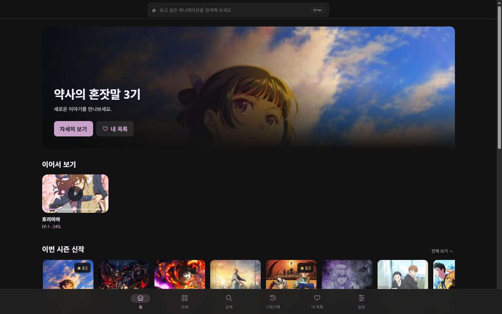

## 주요 기능

- **여러 사이트를 한 곳에서**: RE:Anime · Miruro · Animenosub · 애니24 · 링크애니 · Linkkf. 영어 제목 사이트도 한국어 제목으로 보여 주고 한국어로 검색합니다.
- **한국어 자막 자동**: 사이트의 한국어 트랙, Kairan · Csora · Anissia 블로그 자막을 알아서 찾아 입힙니다.
- **없으면 AI 번역**: Jimaku 일본어 자막이나 사이트의 일본어·영어 트랙을 번역 API(Gemini · OpenAI · DeepL · Qwen)나 내 PC의 로컬 AI(Gemma 4 · Aya · Hy-MT2)로 번역합니다. **보고 있는 장면부터 번역해 번역된 줄은 바로 한국어로** 바뀌고, 다음 화는 보는 동안 미리 번역해 둡니다.
- **한국어 제목 · 줄거리**: 영어 사이트의 작품도 한국어 제목으로 보여 주고, TMDB 키가 있으면 줄거리도 한국어로 보여 줍니다.
- **OP/ED 건너뛰기 · 이어보기 · 다음 화 자동 재생 · 키보드 단축키**
- **다운로드**: 자막·OP/ED 구간까지 함께 저장해 오프라인에서도 그대로 봅니다. 외장하드로 옮겨도 저장 폴더만 바꾸면 다시 이어집니다.

| | |
|---|---|
| 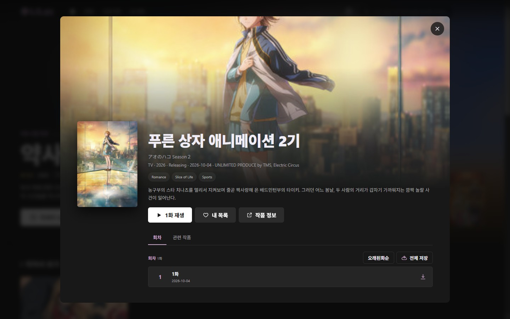 | 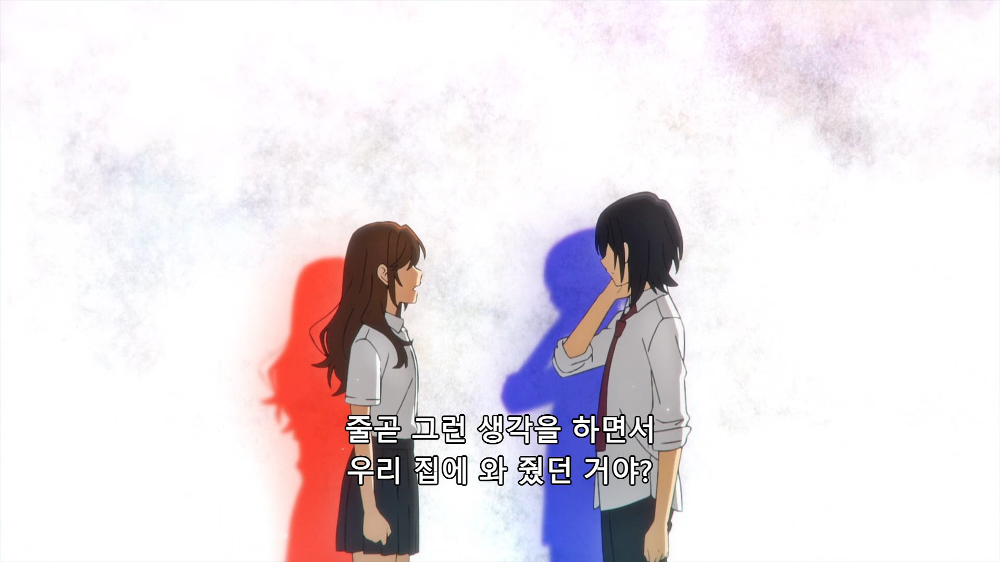 |
| **작품 상세** · 회차 목록, 이어보기, 전체 저장 | **재생** · 한국어 자막이 없는 회차를 Gemini로 번역한 자막 |
| 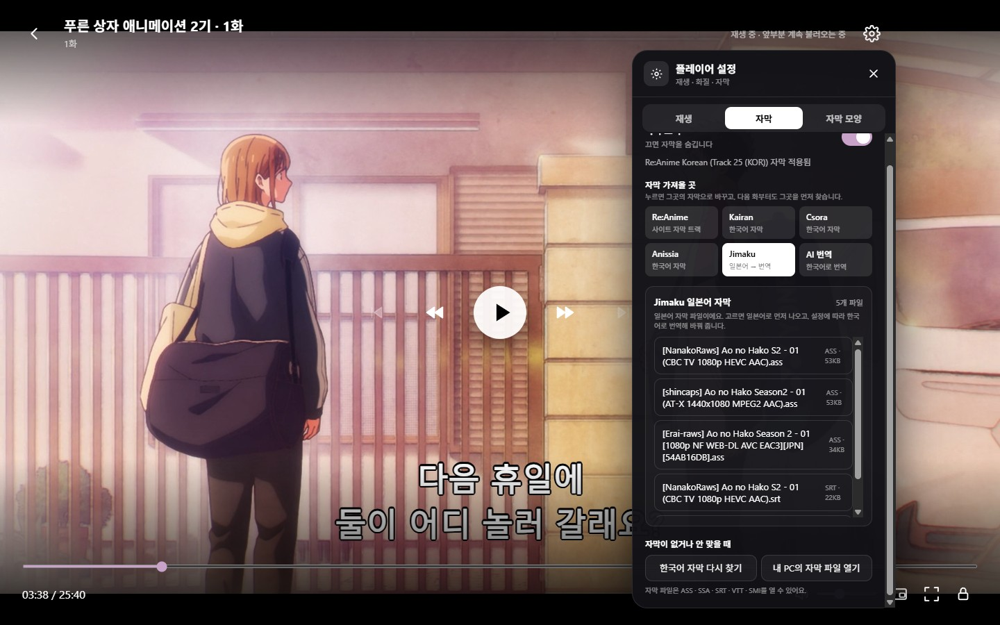 | 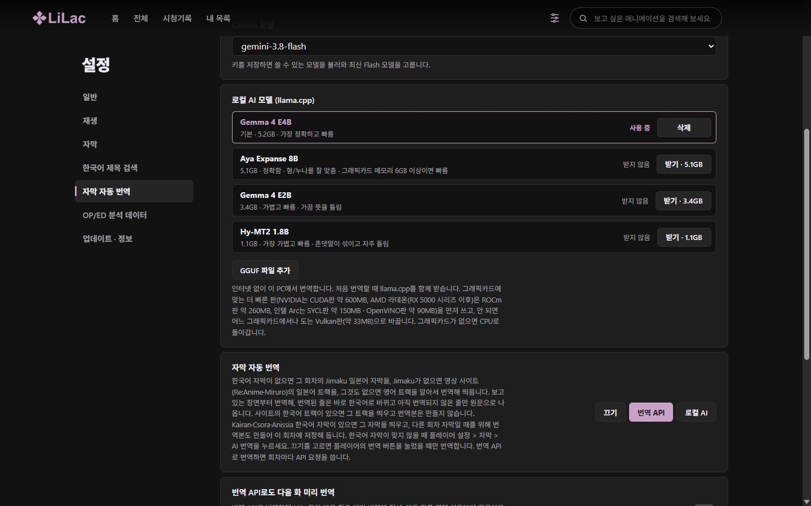 |
| **플레이어 설정 > 자막** · 자막 가져올 곳과 Jimaku 파일 | **설정 > 자막 자동 번역** · 로컬 AI 모델과 마지막 실행 위치 |
| 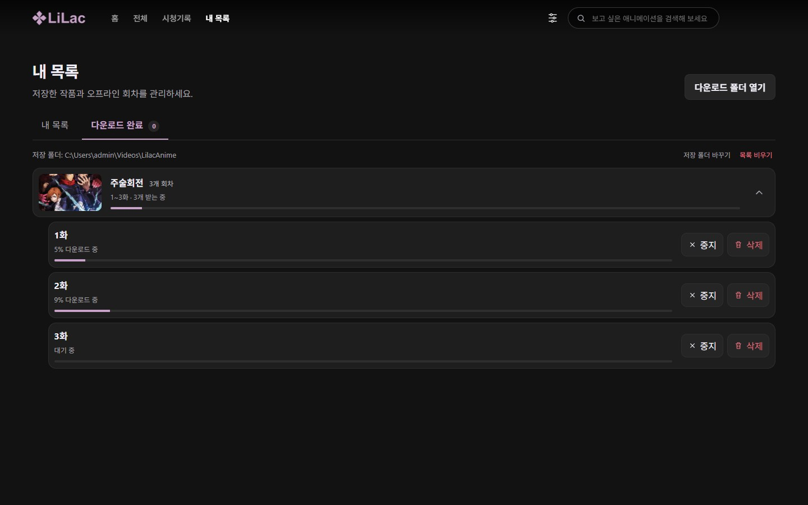 | |
| **내 목록 > 다운로드** · 작품별로 묶인 회차, 저장 폴더 바꾸기 | |

## 설치

### Windows

1. **[LilacAnime-Setup.exe 받기](https://github.com/whispelyn-byte/LilacAnime-desktop/releases/latest/download/LilacAnime-Setup.exe)**: 항상 최신 버전이 받아집니다. ([모든 릴리즈](https://github.com/whispelyn-byte/LilacAnime-desktop/releases))
2. 실행해서 설치 위치를 고르고 설치합니다. 바탕 화면에 바로가기가 생깁니다.

설치한 뒤에는 새 버전이 나오면 앱이 알려 주고, **설정 > 업데이트 · 정보**에서 바로 받아 설치할 수 있습니다. 업데이트하면 바뀐 점이 처음 한 번 표시됩니다.

### macOS

1. 내 Mac에 맞는 파일을 받습니다 (**Apple 메뉴 > 이 Mac에 관하여**에서 칩이 Apple M…이면 Apple Silicon, Intel이면 Intel):
   - **[Apple Silicon (M1 이상)](https://github.com/whispelyn-byte/LilacAnime-desktop/releases/latest/download/LilacAnime-mac-arm64.dmg)**
   - **[Intel](https://github.com/whispelyn-byte/LilacAnime-desktop/releases/latest/download/LilacAnime-mac-x64.dmg)**
2. 받은 `.dmg`를 열고 LilacAnime을 **응용 프로그램** 폴더로 끌어 놓습니다.
3. 처음 열 때 "Apple은 악성 코드가 없음을 확인할 수 없습니다"라고 나옵니다 (Apple 개발자 인증서로 서명하지 않은 앱이라서). **완료**를 누른 뒤 **시스템 설정 > 개인정보 보호 및 보안** 아래의 **그래도 열기**를 누르고, 한 번 더 **열기**를 누릅니다. 다음부터는 그냥 열립니다.
   - 그래도 열리지 않으면 터미널에서 `xattr -cr /Applications/LilacAnime.app`을 실행한 뒤 다시 엽니다.

Mac에서는 업데이트를 받아 **지금 설치**를 누르면 새 버전의 `.dmg`가 열리고 앱이 닫힙니다. 2번처럼 응용 프로그램 폴더로 끌어 놓아(**대치**) 바꿉니다.

## 처음 쓸 때

설정은 오른쪽 위 톱니바퀴 버튼에 있고, 왼쪽에서 분류를 고르면 그 설정이 나옵니다.

1. **설정 > 재생 > 콘텐츠 / 영상 소스**에서 볼 사이트를 고릅니다. 바꾸면 바로 목록을 다시 불러옵니다.
2. **설정 > 일반 > 작품 제목 표시**에서 한국어 / 영어를 고릅니다.
3. **(강력 추천) 설정 > 한국어 제목 검색**에 TMDB API 키를 넣습니다. 한국어 자막을 훨씬 많이 찾고, 제목 · 줄거리도 한국어로 나옵니다. → [TMDB 키 넣기](#tmdb-키-넣기-꼭-해-주세요)
4. (선택) 자막 번역을 쓰려면 **설정 > 자막 자동 번역**에서 번역 API(Gemini · OpenAI · DeepL · Qwen) 키를 넣거나 로컬 AI 모델을 받습니다. → [번역 시작하기](#번역-시작하기)

## 사용법

### 애니 보기

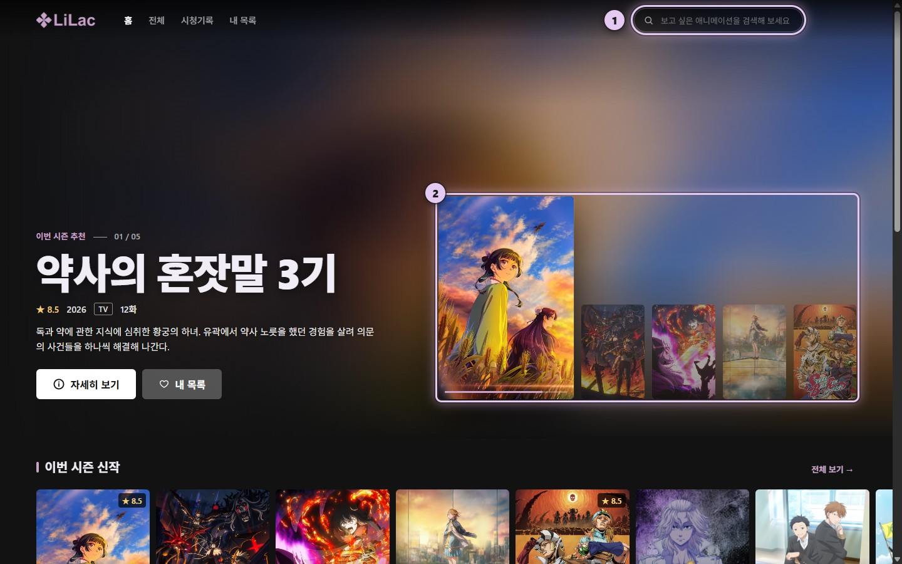

1. 위쪽 검색창에 제목을 한국어로 입력하고 Enter를 누릅니다.
2. 또는 홈 맨 위의 **이번 시즌 추천**에서 고릅니다. 작은 포스터를 누르면 그 작품으로 바뀌고, 큰 포스터를 누르면 작품 화면이 열립니다. 아래의 이번 시즌 신작 · 인기 순위를 둘러보다가 작품을 눌러도 됩니다.

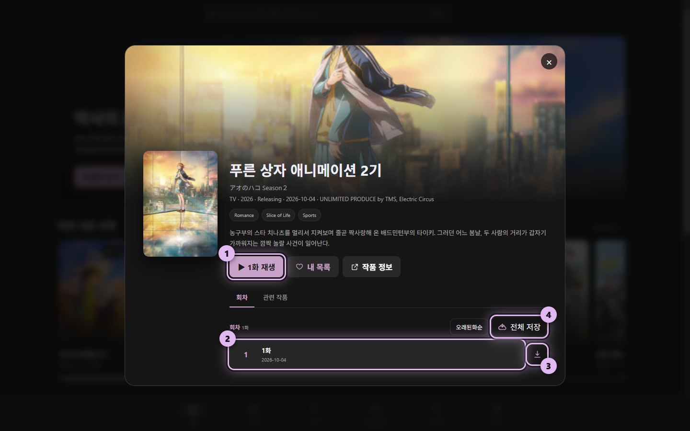

1. **○화 재생**을 누르면 첫 화부터(본 적이 있으면 **이어보기**로 멈춘 곳부터) 재생합니다.
2. 보고 싶은 회차를 골라 눌러도 됩니다.
3. 회차 옆 버튼은 그 회차만 내려받습니다 → [오프라인으로 보기](#오프라인으로-보기)
4. **전체 저장**은 모든 회차를 내려받습니다.

자막은 앱이 알아서 찾아 입힙니다. 따로 할 일은 없습니다. 보다가 나가도 괜찮습니다. 홈의 **이어서 보기**나 위쪽 **시청기록**에서 누르면 멈춘 곳부터 이어집니다.

### TMDB 키 넣기 (꼭 해 주세요)

**한국어 자막을 찾는 데 가장 중요한 설정입니다.** RE:Anime · Miruro · Animenosub는 작품 제목이 영어라서, 한국어 자막(Kairan · Csora · Anissia)을 찾으려면 그 작품의 한국어 제목을 알아야 합니다. TMDB 키가 있으면 훨씬 많은 작품의 한국어 제목을 찾아서 한국어 자막이 더 많이 붙고, 제목과 줄거리도 한국어로 나옵니다. 키 없이도 쓸 수는 있지만 한국어 제목을 못 찾는 작품이 많습니다.

키는 무료이고, PC 브라우저로 5분쯤 걸립니다 (TMDB 신청 화면이 휴대폰에서는 잘 안 됩니다).

**TMDB에서 키 받기:**

1. [themoviedb.org 가입](https://www.themoviedb.org/signup)을 하고, 받은 메일의 링크를 눌러 인증합니다.
2. 로그인한 뒤 [설정 > API](https://www.themoviedb.org/settings/api)로 갑니다 (오른쪽 위 프로필 > 설정 > 왼쪽 메뉴의 API).
3. API 키 만들기(Create / Request an API Key)를 누르고 **Developer**를 고른 뒤 이용 약관에 동의합니다.
4. 신청서를 채웁니다. 사용 용도는 개인(Personal), 앱 이름은 `LilacAnime`, 앱 주소는 아무 주소(예: 이 GitHub 주소), 설명은 "개인용 애니 제목 검색"처럼 쓰면 됩니다.
5. 바로 발급된 **API 키**(영문 · 숫자 32자)를 복사합니다. 그 아래 긴 **읽기 액세스 토큰**을 넣어도 됩니다.

**앱에 넣기:**

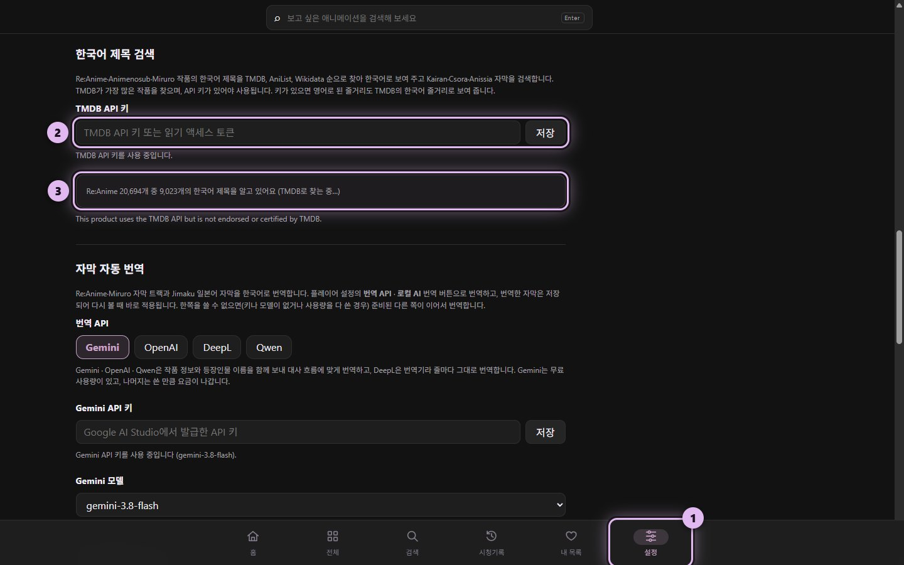

1. 오른쪽 위 **설정**(톱니바퀴)을 누릅니다.
2. 왼쪽에서 **한국어 제목 검색**을 고릅니다.
3. **TMDB API 키** 칸에 붙여 넣고 **저장**을 누릅니다. 맞는 키면 "TMDB API 키를 사용 중입니다"가 나옵니다.
4. 이 칸에서 TMDB로 한국어 제목을 찾아 갑니다 ("… 중 …개의 한국어 제목을 알고 있어요"). 처음엔 몇 분 걸리고, 그동안에도 앱은 그대로 쓸 수 있습니다.

앱은 한국어 제목을 **TMDB → AniList → Wikidata** 순으로 찾습니다. 키가 없으면 AniList와 Wikidata로만 찾습니다. 줄거리는 작품 상세와 홈 맨 위에 TMDB의 한국어 줄거리로 나오고, 2기 이후 시즌은 그 시즌의 줄거리가 있으면 그것을, 없으면 작품 전체 줄거리를 씁니다 (TMDB에 한국어 줄거리가 없으면 원래 줄거리).

### 자막 고르기 · 다시 번역

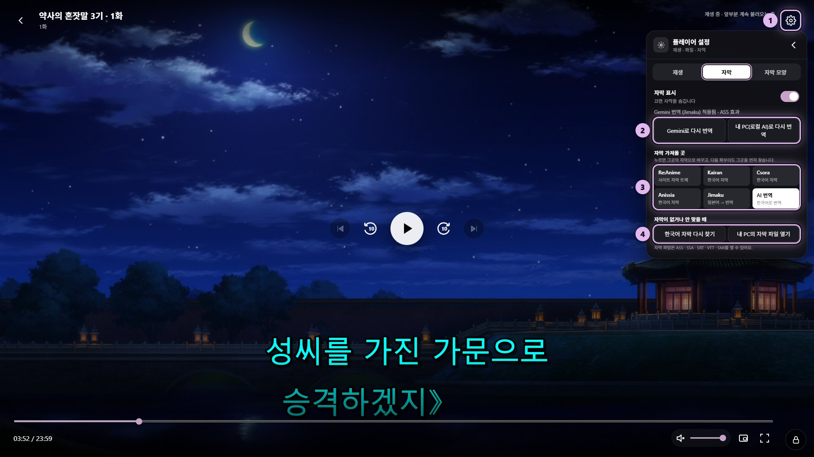

1. 재생 화면 오른쪽 위의 **플레이어 설정** 버튼을 누릅니다.
2. **자막** 탭을 엽니다.
3. **자막 가져올 곳:** 다른 회차 자막이 나오면 **AI 번역**을 누르면 이 회차에 맞는 번역 자막으로 바뀝니다. 다른 블로그(Kairan · Csora · Anissia)를 골라 봐도 됩니다.
4. **자막 트랙 (RE:Anime · Miruro):** 사이트가 주는 여러 언어 자막입니다. 영어 · 일본어 트랙을 골라 볼 수도 있습니다.
5. **한국어 자막 다시 찾기** · **내 PC의 자막 파일 열기**(ASS · SSA · SRT · VTT · SMI)

AI 번역 자막이나 영어 · 일본어 자막이 떠 있으면 **자막 표시** 아래에 번역 버튼이 나옵니다. AI 번역 자막이 어색하면 **다시 번역**을 눌러 처음부터 새로 번역합니다. 로컬 AI로 번역했다면 번역 API 쪽 버튼으로 바꿔 보면 더 자연스럽습니다.

### 자막 크기 · 싱크 · 글꼴

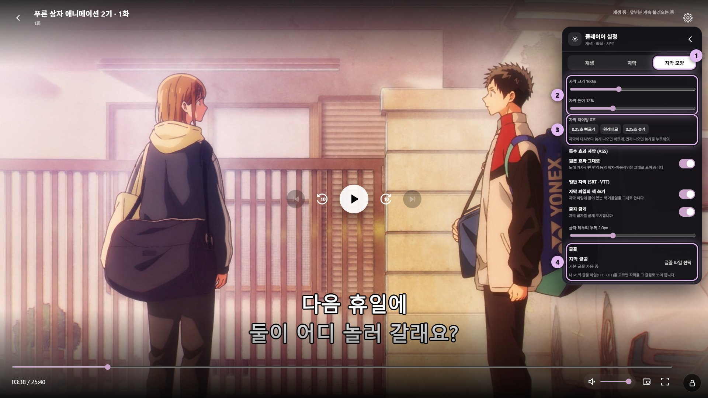

1. 플레이어 설정에서 **자막 모양** 탭을 엽니다.
2. **자막 크기 · 높이:** 막대를 끌어 바꿉니다.
3. **자막 타이밍:** 자막이 대사보다 늦으면 **빠르게**, 먼저 나오면 **늦게**를 누릅니다. 보면서 **Z** · **X** 키로 0.5초씩 바꿀 수도 있습니다.
4. **글꼴:** 내 PC의 글꼴 파일(TTF · OTF)을 고르면 자막이 그 글꼴로 나옵니다. AI 번역 자막도 이 글꼴을 씁니다.

### 번역 시작하기

한국어 자막이 없는 작품도 보려면 번역을 하나 준비해 둡니다. 둘 중 하나만 있으면 됩니다.

| | 번역 API (추천: Gemini) | 로컬 AI |
|---|---|---|
| 비용 | Gemini는 무료 사용량으로 충분 | 무료, 한도 없음 |
| 품질 · 속도 | 더 자연스럽고 빠름 (한 화 2~3분) | 조금 어색할 수 있음 (한 화 2~9분, 그래픽카드에 따라) |
| 필요한 것 | 인터넷, API 키 | 모델 파일 1~5GB, 그래픽카드가 있으면 빠름 |

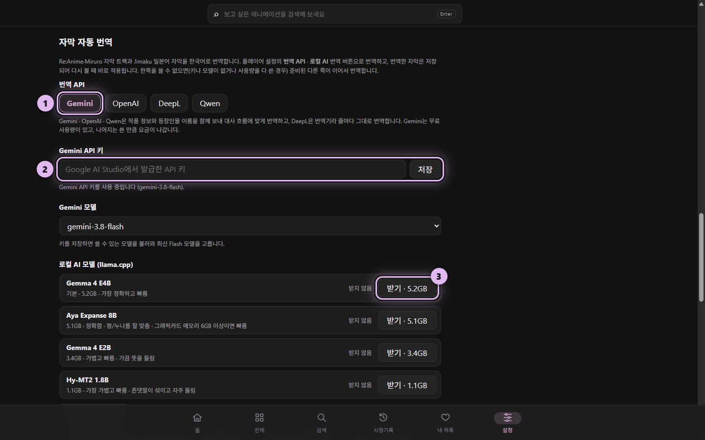

**Gemini 키로 시작하기 (무료, 약 1분):**

1. [Google AI Studio](https://aistudio.google.com/apikey)에 구글 계정으로 로그인하고 **Create API key**를 눌러 키를 만든 뒤 복사합니다. 앱의 오른쪽 위 **설정**에서 왼쪽의 **자막 자동 번역**을 고르고, 번역 API를 **Gemini**로 고릅니다.
2. 키를 붙여 넣고 **저장**을 누릅니다.

**로컬 AI로 시작하기:**

3. **Gemma 4 E4B**의 **받기**를 누릅니다 (5.2GB). 다 받으면 **사용 중**으로 바뀌고 끝입니다. 처음 번역할 때 번역 프로그램을 알아서 받아 설치합니다.

자동 번역은 처음부터 켜져 있어서, 준비가 되면 한국어 자막이 없는 회차를 열기만 하면 됩니다. 보고 있는 장면부터 번역해서, 몇 초 뒤면 대사가 한국어로 바뀝니다. 한 번 번역한 회차는 저장되어 다음엔 바로 나옵니다. 자세한 내용은 [자막 번역](#자막-번역)에 있습니다.

### 오프라인으로 보기

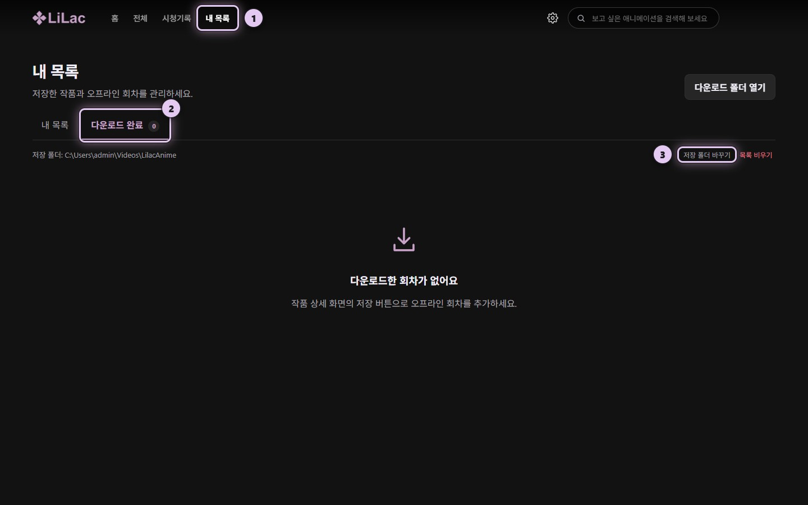

작품 화면에서 회차 옆 버튼이나 **전체 저장**으로 받은 회차는 이곳에 작품별로 모입니다. 인터넷 없이도 자막까지 그대로 나옵니다.

1. 위쪽 **내 목록**을 누릅니다.
2. **다운로드 완료** 탭에 받은 회차가 있습니다.
3. **저장 폴더 바꾸기:** 새로 받을 폴더를 바꿉니다. 받은 파일을 외장하드로 옮겼다면 옮긴 폴더를 고르면 다시 이어집니다.

## 콘텐츠 소스

| 소스 | 목록·검색 | 영상 | 자막 |
|---|---|---|---|
| **RE:Anime** | 2만여 작품, 한국어 검색 | 자막 없는 영상 | 사이트의 여러 언어 자막 트랙 (한국어 트랙이 있으면 자동 적용) |
| **Miruro** | 한국어 검색, 회차 제목·방영일 | 서버 선택: SUB · RAW · SOFT · DUB | SOFT 서버의 여러 언어 자막 트랙 |
| **Animenosub** | 한국어 검색 | 서버 선택: SUB · RAW | 한국어 자막은 온라인 검색 |
| **애니24** | 한국어 목록·검색, 원제·장르·방영일 | 1080p, 한국어 자막이 영상에 들어 있음 | 영상에 박힌 한국어 자막 (다른 자막을 찾거나 번역하지 않음) |
| **링크애니** ([linkani.tv](https://linkani.tv)) | 한국어 목록·검색, 장르·제작사·연도, TOP(인기순) | 1080p, 한국어 자막이 영상에 들어 있음 | 영상에 박힌 한국어 자막 (다른 자막을 찾거나 번역하지 않음) |
| **Linkkf** | 한국어 목록 | 사이트 기본 영상 | 사이트의 한국어 자막 |

- 영어 제목인 사이트(RE:Anime·Miruro·Animenosub)도 한국어 제목으로 보여 주고 한국어로 검색할 수 있습니다. 2기 이후 시즌은 "○○ 2기"처럼 표시합니다.
- **영상 서버 (Miruro·Animenosub):** 한국어 자막이 있으면 자막 없는 영상(RAW / SOFT)에 한국어 자막을, 없으면 영어 자막이 박힌 SUB를 고릅니다. 플레이어 설정 > 영상 서버에서 직접 고를 수도 있고, 고른 서버는 다음 회차에도 유지됩니다.
  - **SUB:** 영어 자막이 영상에 박혀 있음
  - **RAW:** 자막 없음
  - **SOFT (Miruro):** 자막 없는 영상 + 자막 파일. 자막 트랙을 바꾸거나 번역할 수 있습니다.
  - **DUB:** 영어 더빙
- **사이트 장애:** 고른 사이트의 서버가 응답하지 않으면 홈 맨 위에 안내가 나오고(작품 정보만 표시), **다시 시도** · **소스 바꾸기**로 이어 갈 수 있습니다.

## 자막

재생을 시작하면 이 순서로 자막을 정합니다.

1. 이 회차에 저장해 둔 자막 (직접 고른 자막, 번역한 자막)
2. 영상에 딸린 한국어 자막 (RE:Anime·Miruro의 한국어 트랙, Linkkf)
3. 온라인 한국어 자막: **Kairan · Csora · Anissia** (세 곳을 동시에 찾고, 설정에서 고른 소스가 먼저)
4. 한국어 자막이 없으면 **번역할 자막을 띄우고 한국어로 번역**합니다. 보고 있는 장면부터 번역해 번역된 줄은 바로 한국어로 바뀌고, 아직 번역되지 않은 줄만 잠깐 원문으로 나옵니다. 다른 장면으로 건너뛰면 그 장면부터 번역합니다.
   번역할 자막은 **Jimaku 일본어 자막 → 사이트의 일본어 트랙 → 사이트의 영어 트랙** 순으로 고릅니다 (영어 트랙이 여럿이면 대사 트랙).

Kairan · Csora · Anissia 한국어 자막으로 볼 때도 같은 순서로 **번역본을 하나 더 만들어** 이 회차에 저장해 둡니다 (사이트의 한국어 트랙이면 만들지 않습니다). 블로그 자막이 다른 회차·시즌 것으로 잘못 맞춰졌을 때 플레이어 설정 > 자막 > **AI 번역**을 누르면 바로 바뀝니다. 회차를 다시 열면 한국어 자막이 먼저 나옵니다.

한국어 자막이 있는데 번역 버튼이나 AI 번역을 누르면(Jimaku 파일을 직접 골라도), 그 작품은 다음 화부터 **AI 번역 자막을 먼저** 띄웁니다. 한국어 자막을 다시 고르면 원래대로 돌아갑니다.

플레이어 설정 > 자막에서는 자막을 가져올 곳(Re:Anime·Miruro, Kairan, Csora, Anissia, Jimaku, AI 번역)을 고르고, 고른 곳의 목록(자막 트랙, Jimaku 파일, Anissia 제작자)이 그 아래에 펼쳐집니다. 영어·일본어 자막이 떠 있으면 위쪽에 번역 버튼이 나옵니다.

번역은 **설정 > 자막 자동 번역**이 번역 API나 로컬 AI로 되어 있고, 둘 중 하나가 준비돼 있을 때 합니다. 끄면 플레이어의 번역 버튼을 눌렀을 때만 번역합니다.

### 자막 소스

| 소스 | 설명 |
|---|---|
| Kairan | [kairan03.blogspot.com](https://kairan03.blogspot.com) |
| Csora | [csora556.blogspot.com](https://csora556.blogspot.com) |
| Anissia | [anissia.net](https://anissia.net) 자막 편성표에 등록된 제작자의 블로그 (Blogger, 티스토리, 네이버 블로그). 플레이어 설정에서 제작자를 직접 고를 수 있습니다. 글 이미지 안에 자막을 넣어 두는 블로그([WinPNG](https://github.com/harnenim/WinPNG))도 읽습니다. |
| Jimaku | [jimaku.cc](https://jimaku.cc)의 **일본어** 자막. 플레이어 설정 > 자막에 그 회차의 파일 목록이 늘 나오고, 고른 파일을 적용합니다. API 키는 필요 없습니다. |
| RE:Anime · Miruro 트랙 | 사이트가 주는 여러 언어 자막. 플레이어 설정의 자막 트랙에서 고릅니다. |
| 내 파일 | 내 PC의 ASS / SSA / SRT / VTT / SMI 파일 |

- 2기 이후 시즌을 1기에 이어서 번호 매기는 블로그(예: 2기 3화를 "15화"로 올린 글)도 찾습니다.
- ASS 자막은 원본의 위치·색상·효과 그대로 보여 주고, 자막에 쓰인 폰트도 함께 받아 씁니다. AI 번역 자막은 위치·효과 없이 일반 자막처럼 보여 줍니다.
- SRT·VTT 자막에 남은 `{\an8}` 같은 표시는 지우고, 그런 줄(효과음 · 화면 글자 설명)은 화면 위쪽에 보여 줍니다.
- 자막 크기·높이·타이밍, 글꼴, 일반 자막(SRT·VTT)의 테두리·굵기는 플레이어 설정 > 자막 모양에서 바꿀 수 있습니다.

### 자막 번역

번역한 자막은 이 회차에 저장되어 다음에 볼 때 바로 적용됩니다.

- **자동 번역:** 위 [자막](#자막) 순서대로 알아서 번역합니다.
- **바로 보기:** 한 화를 다 번역할 때까지 기다리지 않습니다. 보고 있는 장면부터 번역해 번역된 줄은 바로 한국어로 바뀌고, 다른 장면으로 건너뛰면 그 장면부터 번역합니다. 처음 몇 초(로컬 AI는 모델을 올리는 동안)와 건너뛴 직후 몇 초만 원문이 보입니다.
- **직접 번역:** 플레이어 설정 > 자막에서 RE:Anime·Miruro 트랙이나 Jimaku 파일, 내 PC의 자막 파일을 고르면 **(번역 API)로 한국어 번역** · **내 PC(로컬 AI)로 번역** 버튼이 나옵니다.
- **다시 번역:** AI 번역 자막이 떠 있으면 같은 버튼이 **다시 번역**으로 바뀝니다. 저장된 번역본 대신 원문부터 새로 번역해 그 자리를 바꿉니다 (번역이 이상할 때).
- **취소 · 이어서 번역:** 번역 중인 버튼을 다시 누르면 멈춥니다. 다른 회차로 넘어가도 멈춥니다. 번역한 줄은 남아 있어서, 다시 번역하면 멈춘 곳부터 이어서 합니다 (앱을 껐다 켜도).
- **번역해 둔 자막:** 같은 자막을 번역해 둔 게 있으면 다시 번역하지 않고 그대로 씁니다. 번역 API와 로컬 AI는 따로 셉니다: 번역 API로 번역해 뒀어도 로컬 AI 버튼을 누르면 로컬 AI로 번역하고, 둘 다 저장해 둡니다.
- **다음 화 미리 번역:** 로컬 AI로 한 화를 번역하면, 보는 동안 다음 화도 미리 번역해 둡니다 (Jimaku, 없으면 사이트의 일본어·영어 트랙). 번역 API는 **설정 > 자막 자동 번역 > 번역 API로도 다음 화 미리 번역**을 켰을 때만 합니다 (사용량을 미리 쓰므로 처음엔 꺼짐). 다음 화를 열면 바로 한국어 자막이 나오고, 아직 번역 중이면 그때까지 번역된 줄부터 나옵니다.
  - 미리 번역도 다음 화의 번역도 **그 작품을 마지막으로 번역한 쪽**이 합니다. 설정이 번역 API여도 한 화를 **내 PC(로컬 AI)로 번역**했다면, 그 작품의 다음 화는 로컬 AI로 미리 번역하고 그 번역을 띄웁니다. 번역 API 버튼으로 번역하면 다시 번역 API로 돌아갑니다. 자막 자동 번역이 **끄기**이면 미리 번역하지 않습니다.
  - 미리 번역하다가 번역 API 한도가 차면 같은 API의 다른 모델 → 키가 있는 다른 API → 로컬 AI 순으로 넘어가 남은 줄을 이어서 번역합니다. 이렇게 다른 쪽이 마무리한 번역도 다음 화를 열 때 그대로 씁니다 (같은 번역을 다시 하지 않음). 번역 버튼을 직접 누르면 그 버튼 쪽으로 새로 번역합니다.
  - Jimaku 파일을 직접 골랐다면 다음 화도 **같은 제작자 · 같은 형식의 파일**(이름에서 회차 번호만 다른 파일)을 먼저 씁니다. 다음 화에 그 파일이 없으면 평소처럼 가장 알맞은 파일을 씁니다.
- **이어받기:** 고른 모델의 사용량을 다 쓰면 먼저 같은 API의 다른 모델이 이어받고([번역 API](#번역-api)), 키 전체를 쓸 수 없으면(키 없음, 크레딧 없음) 키가 있는 다른 API가, 그다음 로컬 AI가 이어서 번역하고 무엇으로 번역했는지 알려 줍니다. **내 PC(로컬 AI)로 번역** 버튼을 직접 눌렀을 때는 번역 API로 넘어가지 않고, 안 되는 이유를 알려 줍니다.
- **중국어·일본어가 함께 든 자막:** Jimaku의 CHS+JPN 파일은 일본어 줄만 번역합니다 (같은 대사가 두 번 나오지 않게).
- **효과가 있는 ASS 자막:** 번역본은 위치 · 색 · 효과 없이 일반 자막(기본 글꼴, 자막 모양 설정)으로 나옵니다.

번역 API(DeepL 제외)에는 작품 제목·줄거리와 주요 등장인물 이름(AniList)을 함께 보내 이름이 매번 같게, 말투는 관계에 맞게 옮겨지도록 합니다.

#### 번역 API

**설정 > 자막 자동 번역 > 번역 API**에서 하나를 고르고 키를 넣습니다. 키를 저장할 때 맞는 키인지 확인하고, 쓸 수 있는 모델을 불러옵니다.

| API | 키 받는 곳 | 특징 |
|---|---|---|
| **Gemini** | [Google AI Studio](https://aistudio.google.com/apikey) | 무료 사용량이 있음 (하루 한도). 최신 Flash 모델을 고름 |
| **OpenAI** | [OpenAI API keys](https://platform.openai.com/api-keys) | 쓴 만큼 요금. 최신 mini 모델을 고름 |
| **DeepL** | [DeepL API](https://www.deepl.com/pro-api) | 번역기라 줄마다 그대로 번역. 무료 키(끝이 `:fx`)도 됨 |
| **Qwen** | Alibaba Cloud Model Studio | 쓴 만큼 요금. 키를 만든 지역(국제 · 중국)을 함께 고름. qwen-plus를 고름 |

고른 모델의 사용량을 다 쓰거나 서버가 바빠 답하지 못하면 같은 API의 같은 급 모델이 이어서 번역합니다 (Gemini는 Flash · Flash-Lite, OpenAI는 mini · nano, Qwen은 plus · flash · turbo). Gemini 무료 사용량은 모델마다 하루 20번 정도로 따로라, 다른 Flash 모델로 계속 번역할 수 있습니다 (한 화에 2번: 처음 40줄, 나머지. 아직 번역되지 않은 곳으로 건너뛰면 1번 더). 다 쓴 모델은 사용량이 다시 생길 때까지(Gemini는 미국 태평양 시간 자정, 나머지는 1시간) 건너뜁니다. OpenAI 크레딧이 떨어진 경우처럼 키 전체를 못 쓰면 다른 API나 로컬 AI가 이어받습니다.

#### 로컬 AI

인터넷이나 API 키 없이 이 PC에서 번역합니다. 사용 한도도 없습니다.

1. **설정 > 자막 자동 번역 > 로컬 AI 모델**에서 모델의 **받기**를 누릅니다. 받다가 끊기면 **이어 받기**로 이어서 받고, 받는 중에 누르면 멈춥니다.
2. 처음 번역할 때 번역 프로그램([llama.cpp](https://github.com/ggml-org/llama.cpp))을 자동으로 받습니다. 그래픽카드에 맞는 판을 먼저 쓰고, 실행되지 않거나 그래픽카드를 못 잡으면 다음 판으로 넘어갑니다 (한 번 안 된 판은 그래픽 드라이버가 바뀔 때까지 다시 쓰지 않음). 한 달에 한 번 새 버전을 확인합니다.

   | 그래픽카드 | 쓰는 순서 |
   |---|---|
   | NVIDIA | CUDA (약 600MB, Vulkan보다 약 1.5배 빠름) → Vulkan |
   | AMD 라데온 | ROCm (약 260MB: RX 5000 · 6000 · 7000 · 9000 시리즈, 라이젠 내장 680M · 780M · 890M 등) → Vulkan. 그보다 오래된 RX 400 · 500 · Vega는 바로 Vulkan |
   | 인텔 Arc | SYCL (약 150MB) → OpenVINO (약 90MB) → Vulkan |
   | 그 밖 | Vulkan (약 33MB) |

   ROCm · SYCL · OpenVINO판은 AMD · 인텔 그래픽카드에서 직접 돌려 보지 못했습니다 (안 되면 Vulkan판으로 넘어가는 것까지만 확인).
3. 그래픽카드가 있으면 그래픽카드로, 없으면 CPU로 번역합니다. 번역할 때만 실행되고 30초 동안 쓰지 않으면 꺼집니다. 다른 프로그램이 그래픽카드 메모리를 쓰고 있어 모델을 올리지 못하면, 여유를 두고 다시 올리거나 이번만 CPU로 번역합니다 (그 판을 못 쓰는 것으로 기록하지 않음).
4. 설정의 모델 목록에 마지막으로 어디서 돌았는지 표시됩니다 (예: `NVIDIA GeForce GTX 1050 Ti · CUDA · 33/33층`). 그래픽카드 메모리에 다 안 들어가는 모델은 일부가 CPU에서 돌아 느립니다.

| 모델 | 크기 | 점수 (16점) | 평가 | 형·누나 (7줄) | 한 화 번역 시간 |
|---|---|---|---|---|---|
| Gemma 4 E4B (기본) | 5.2GB | 13.5 | 가장 정확함. 2줄 틀림 | 7/7 | 5분 |
| Aya Expanse 8B | 5.1GB | 11 | 3줄 틀림. 형·누나를 다 맞춤, 일본어가 남은 줄 없음 | 7/7 | 9분 |
| Gemma 4 E2B | 3.4GB | 7.5 | 6줄 틀림. 가볍고 빠름 | 4/7 | 3분 |
| Hy-MT2 1.8B | 1.1GB | 5.5 | 8줄 틀림. 존댓말이 섞임. 가장 가벼움 | 4/7 | 2분 |

설정의 모델 목록도 이 순서입니다. 예전 목록에 있던 모델(Hy-MT2 7B · 30B-A3B, Gemma 4 26B-A4B, ja-ko-vn 7B)은 E4B보다 낫지 않아 뺐고, 이미 받은 PC에서는 계속 보이고 쓸 수 있습니다.

자막 줄 앞에 말하는 사람이 적혀 있으면(예: `（創太）`), 그 사람의 성별(AniList)에 맞춰 お兄ちゃん · お姉ちゃん을 형 · 누나 / 오빠 · 언니로 정해 모델에 알려 줍니다. 위 모델 넷 모두 이런 줄은 다 맞췄고(형·누나 7줄 중 말하는 사람이 적힌 4줄), 표의 형·누나 칸은 이것을 넣은 뒤 잰 값입니다 (넣기 전: E4B 6/7, E2B 3/7, Hy-MT2 1.8B 0/7).

Horimiya 1화(Jimaku SubsPlease 일본어 자막, 같은 대사를 빼면 425줄)를 앱과 같은 방식으로 모두 번역해, 장면 16개를 원문과 비교하고(맞은 줄 1점, 어색한 줄 0.5점) 소타가 부르는 お姉ちゃん · お兄ちゃん 7줄이 누나 · 형으로 옮겨졌는지 셌습니다. 시간은 GTX 1050 Ti(4GB) · Ryzen 5 5600 · 램 32GB PC에서 CUDA판으로 잰 것입니다. 같은 화를 번역 API로는 Gemini(gemini-3.6-flash)가 약 2분 30초에 번역했습니다. 다른 GGUF 모델 파일을 **GGUF 파일 추가**로 넣어 쓸 수도 있습니다.

## 플레이어

- 이전 / 다음 화, 다음 화 자동 재생, 화면 잠금
- 화질·재생 속도 선택, 자막이 함께 나오는 PIP
- **OP/ED 건너뛰기:** 버튼 또는 자동 건너뛰기. [AniSkip](https://aniskip.com) 타임스탬프를 쓰고, 없으면 다운로드한 다른 회차와 오디오를 비교해 찾습니다.
- **이어보기:** 마지막에 본 회차를 재생합니다 (95% 이상 봤으면 처음부터, 그 전이면 멈춘 위치부터).
- **백그라운드 재생:** 창을 내리거나 최소화해도 계속 재생되고, Windows 미디어 키·볼륨 창·잠금 화면에서 조작할 수 있습니다.
- **키보드 / 리모컨:** 방향키로 이동, Enter로 선택, Esc로 닫기·뒤로

| 키 | 재생 중 |
|---|---|
| Space · Enter | 재생 / 일시 정지 |
| ← · → | 뒤로 / 앞으로 (설정 > 재생 > 뒤로/앞으로 버튼 이동 시간, 기본 10초) |
| 0 ~ 9 | 영상의 0% ~ 90% 위치로 |
| [ · ] | 재생 속도 느리게 / 빠르게 |
| C | 자막 켜기 / 끄기 |
| Z · X | 자막 싱크 0.5초 빠르게 / 늦게 |
| S | OP/ED 건너뛰기 (구간이 나올 때) |
| F · M | 전체 화면 · 음소거 |
| PageUp · PageDown | 이전 화 · 다음 화 |
| Esc | 설정 닫기 · 전체 화면이면 창으로 · 뒤로 |

## 다운로드

- 회차 옆 다운로드 버튼이나 **전체 저장**으로 내려받습니다. 두 회차씩 동시에 받습니다.
- 자막·폰트·자막 트랙·OP/ED 구간을 함께 저장해 오프라인에서도 그대로 재생합니다.
- 한국어 번역본도 하나 만들어 둡니다: Jimaku 자막(자막 자동 번역이 켜져 있을 때), 없으면 일본어 트랙, 그것도 없으면 영어 트랙. Kairan · Csora · Anissia 한국어 자막이 있어도 만들어 둡니다 (다른 회차 자막이 잘못 맞춰졌을 때를 위해). 사이트에 한국어 트랙이 있으면 Jimaku 자막을 받지 않고 번역본도 만들지 않습니다 (설정 > 다운로드할 때 자막 트랙 번역).
- Miruro · 애니24는 최고 화질을 여러 조각씩 동시에 받습니다 (1080p 한 화가 보통 1~7분). 멈췄다가 다시 받으면 받아 둔 조각부터 이어서 받고, 실패하면 30초 · 2분 뒤 두 번 저절로 다시 시도합니다.
- **내 목록 > 다운로드**에서 같은 작품의 회차는 카드 하나로 묶이고, 누르면 받은 회차가 펼쳐집니다.
- **저장 폴더 바꾸기:** 새로 받는 회차를 저장할 폴더를 고릅니다. 받은 회차를 작품 폴더째 외장하드 등으로 옮겼다면 그 폴더를 고르면 자막·자막 트랙·포스터까지 다시 이어집니다. 영상 파일을 찾을 수 없는 회차는 흐리게 표시되고, 열면 온라인으로 재생합니다.
- **목록 비우기:** 다운로드 목록을 한 번에 비웁니다. 영상 파일은 폴더에 남습니다.

## 문제 해결

**영상이 안 나오거나 계속 불러오기만 해요**
- 사이트 서버가 멈춘 경우가 많습니다. 홈 맨 위에 안내가 떠 있으면 **다시 시도**를 누르거나 **소스 바꾸기**로 다른 사이트에서 찾아봅니다.
- Miruro · Animenosub는 플레이어 설정 > 재생 > 영상 서버에서 다른 서버(SUB · RAW · SOFT)를 골라 봅니다.

**한국어 자막을 못 찾아요**
- **설정 > 한국어 제목 검색**에 TMDB 키를 넣으면 훨씬 많이 찾습니다 → [TMDB API 키](#tmdb-키-넣기-꼭-해-주세요)
- 플레이어 설정 > 자막 > **한국어 자막 다시 찾기**를 눌러 봅니다. 그래도 없으면 번역 자막이 대신 나옵니다 ([번역 시작하기](#번역-시작하기)).

**번역이 안 돼요**
- **설정 > 자막 자동 번역**에 키가 들어가 있는지, 자동 번역이 **끄기**로 되어 있지 않은지 확인합니다.
- Gemini 무료 사용량을 다 쓰면 다른 Gemini 모델이 이어서 번역하고, 그것도 다 쓰면 로컬 AI가 이어받습니다 (받아 둔 모델이 있을 때). 무료 사용량은 다음 날(한국 시간 오후 4~5시쯤) 다시 채워집니다.

**로컬 AI로 번역이 안 돼요**
- (Windows) 로컬 AI(llama.cpp)는 Microsoft Visual C++ 런타임으로 실행됩니다. PC에 없으면 "Microsoft Visual C++ 런타임이 없어…"라고 나옵니다. [Visual C++ 재배포 패키지(x64)](https://aka.ms/vs/17/release/vc_redist.x64.exe)를 받아 설치한 뒤 다시 번역하면 됩니다.

**로컬 AI가 메모리가 부족하다고 나와요**
- **설정 > 자막 자동 번역 > 로컬 AI 모델**에서 더 작은 모델로 바꿉니다: Gemma 4 E4B(5.2GB) → **Gemma 4 E2B**(3.4GB) → **Hy-MT2 1.8B**(1.1GB). 안내 문구에 PC 메모리와 모델 크기가 같이 나옵니다.
- 그래픽카드가 작으면(2GB 등) 그래픽카드 → CPU 순으로 알아서 다시 불러오니, "CPU로 불러오는 중"이 나와도 잠시 기다리면 됩니다.

**로컬 AI 번역이 너무 느려요**
- 설정의 모델 목록에서 마지막으로 어디서 돌았는지 확인합니다. `CPU`로 나오거나 층 수가 일부만(예: `20/33층`) 그래픽카드에 올라갔다면, 더 작은 모델(Gemma 4 E2B · Hy-MT2 1.8B)을 쓰거나 게임 같은 다른 프로그램을 끄고 다시 해 봅니다.

**저장 공간이 부족해요**
- **설정 > 자막 자동 번역 > 자막 캐시**에서 쓰지 않는 자막과 번역을 지웁니다.
- 받은 회차는 **내 목록 > 다운로드**에서 지우거나, 저장 폴더를 다른 드라이브로 바꿉니다.

**새 버전으로 바꾸고 싶어요**
- **설정 > 업데이트 · 정보**에서 받아 설치합니다. 새 버전이 나오면 앱이 먼저 알려 줍니다.

## 저장 위치

| 내용 | 위치 |
|---|---|
| 다운로드한 회차 | `동영상\LilacAnime\작품 이름\` (Mac: `~/Movies/LilacAnime/작품 이름/`) (내 목록 > 다운로드 > 저장 폴더 바꾸기로 바꿀 수 있음) |
| 설정, API 키, 자막·번역, 로컬 AI 모델 | `%APPDATA%\lilacanime-desktop\` (Mac: `~/Library/Application Support/lilacanime-desktop/`) |

API 키는 이 PC에만 저장되고 다른 곳으로 보내지 않습니다 (각 키는 그 서비스 요청에만 씁니다).

받아 둔 자막과 번역 중 어느 회차에도 쓰이지 않는 파일은 **설정 > 자막 자동 번역 > 자막 캐시**에서 지울 수 있고, 30일 넘게 쓰지 않은 파일은 앱이 알아서 지웁니다.

## 개발

[Node.js](https://nodejs.org)가 필요합니다.

```powershell
npm install
npm start
```

설치 파일 만들기:

```powershell
npm run dist
```

`dist\LilacAnime-Setup.exe`가 만들어집니다. 앱 버전은 `package.json`의 `version`을 따릅니다.

Mac에서는 `npm run dist:mac`으로 그 Mac의 칩에 맞는 `dist/LilacAnime-mac-arm64.dmg`(또는 `-x64.dmg`)가 만들어집니다.

GitHub Actions(`.github/workflows/build.yml`)로도 만들어집니다. `v0.5.2`처럼 `v`로 시작하는 태그를 올리면 Windows 설치 파일과 Mac용 `.dmg` 두 개(Apple Silicon · Intel)를 만들어 그 태그의 릴리즈에 올립니다. 릴리즈가 아직 없으면 초안(draft)으로 만들어지니, 바뀐 점을 적고 게시하면 됩니다. 이미 있는 릴리즈에 직접 올린 `.exe`는 그대로 둡니다. **Actions > Build > Run workflow**로 돌리면 릴리즈 없이 실행 결과(Artifacts)로만 받을 수 있습니다.

| 폴더 | 내용 |
|---|---|
| `electron/` | 메인 프로세스: 사이트 연결, 자막 검색, 다운로드, 번역, 업데이트 |
| `src/` | 화면: 목록, 상세, 플레이어, 설정 |
| `scripts/` | 빌드 보조 스크립트 |

## 크레딧

- 원작: [dream150/LilacAnime](https://github.com/dream150/LilacAnime) (Android). 원작자의 허락을 받아 Windows · macOS 데스크톱(Electron)용으로 포팅한 프로젝트입니다.
- 자막: Kairan, Csora, [Anissia](https://anissia.net)에 등록된 자막 제작자분들, [Jimaku](https://jimaku.cc)
- 로컬 번역: [llama.cpp](https://github.com/ggml-org/llama.cpp), [Tencent Hy-MT2](https://github.com/Tencent-Hunyuan/Hy-MT2), [Gemma 4](https://huggingface.co/google/gemma-4-E4B-it-qat-q4_0-gguf), [Aya Expanse](https://huggingface.co/CohereLabs/aya-expanse-8b)
- OP/ED 타임스탬프: [AniSkip](https://aniskip.com)
- This product uses the TMDB API but is not endorsed or certified by TMDB.
